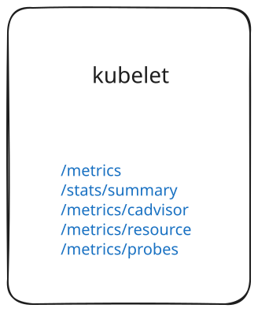

## Intro

When setting up Prometheus observability for Kubernetes, I kept running into the same question again and again:

**What metrics are actually available and where do they come from?** 

This post is my attempt to document all default and optional metric sources in a Kubernetes cluster, grouped by system layer. Additionally, I want to provide a brief overview of each metric type that an endpoint exposes.

## Core Components Recap

Before diving into metrics, here’s a quick reminder of some key Kubernetes components that either generate or expose metrics:

- **Kubelet**  
    Runs on every node. Manages pods and containers. Exposes various metrics including resource usage and probe status.

- **API Server**  
  Central access point for all Kubernetes operations. Tracks requests, authentication, and cluster object interactions.

- **Controller Manager**  
  Reconciles the desired and actual state of cluster resources like Deployments and Nodes. Emits control loop metrics.

- **Scheduler**  
  Assigns unscheduled pods to nodes. Provides insights into scheduling decisions and latency.

- **kube-proxy**  
    Maintains network rules on each node to route traffic to services and pods. Exposes metrics related to connection tracking and iptables/ipvs state.

Yes, there is also **etcd** which can export metrics. It's not covered in detail here because in most managed Kubernetes setups, its metrics aren't directly accessible.

## Metrics by Component

Now lets dive into each component and what kind of metrics it provides.

### Kubelet

Out of all the component metrics, kubelet confused me the most, as it provides multiple endpoints for querying metrics.



We can start exploring its metrics with `kubectl get`, which allows us not only to query resources (as most probably know) but also to send plain **GET requests** to the kubelet on each node through the Kubernetes API server.

```sh
kubectl get --raw /api/v1/nodes/<node-name>/
```

This works because Kubernetes API server implements a **reverse proxy** for kubelet endpoints.  Any of the kubelet’s HTTP paths (‑metrics, ‑logs, ‑stats, etc.) must be prefixed with /proxy/ when you go through the API server.

**kubelet: /stats/summary**

First off, lets look at the `/stats/summary`endpoint of the kubelet, wich emits a structured JSON summary of resource usage for the node itself, each pod on the node and containers inside these pods.

```sh
kubectl get --raw /api/v1/nodes/<node-name>/proxy/stats/summary
```

This endpoint does not provide metrics in a Prometheus-compatible format; however, it was used by early versions of the [metrics server](https://github.com/kubernetes-sigs/metrics-server) to gather pod runtime information (now replaced by the more sophisticated /metrics/resource endpoint). However, this can still be useful for debugging and custom tooling.

**kubelet: /metrics**

Now lets look at the first prometheus endpoint of the kubelet. The `/metrics` endpoint provides a scrape target for the kubelet process itself and provides detailed metrics about the kubelets internal processes, performance and health status.

```sh
kubectl get --raw /api/v1/nodes/<node-name>/proxy/metrics
```

Monitoring `/metrics` is critical for alerting on kubelet failures, debugging performance bottlenecks and understanding control‑plane load. 

**kubelet: metrics/cadvisor**

cAdvisor is a container daemon running on each node that provides detailed container runtime statistics. Its metrics can be accessed via kubelet's `/metrics/cadvisor` endpoint. These metrics focus exclusively on container and host‑hardware stats—not on the kubelet internals or pod‑level aggregations.

```sh
kubectl get --raw /api/v1/nodes/<node-name>/proxy/metrics/cadvisor
```

Looking at the result, we can see that cAdvisor exports a broad range of metrics ranging from simple container resource usage, network bandwidth to inode and disk stats.

**kubelet: metrics/resource**

Unlike `/metrics/cadvisor` (full container stats) or `/stats/summary` (JSON), `/metrics/resource` exposes just the core CPU and memory metrics you need for autoscaling and basic `top` commands. It mainly was introduced in Kubernetes v1.14 to provide a more performant endpoint for autoscalers, as it sits between the cadvisor and the `stats/summary` endpoint in terms of scope and performance.

```sh
kubectl get --raw /api/v1/nodes/<node-name>/proxy/metrics/resource
```


**kubelet: metrics/probes**

This final endpoint exposes detailed information about **liveness**, **readiness** and **startup** probes on each container. It provides metrics such as probes success/failure counters as well as latency histograms for each probe.

```sh
kubectl get --raw /api/v1/nodes/<node-name>/proxy/metrics/probes
```

### API-Server

Our next component is the API-Server itself. It exposes all kinds of metrics related to request latency, volume and error rates for the Kubernetes API itself. It also provides Metrics such as enabled/dasabled K8s features as well as some basic etcd storage metrics. A full list of metrics can be found on the K8s [documentation](https://kubernetes.io/docs/reference/instrumentation/metrics/).

We can inspect the metrics again with kubectl, however this time as we directly query the API-Server endpoints we do not need no proxy routes.

```sh
kubectl get --raw /metrics
```

### Controller Manager

Next is the Controller-Manager. It exposes metrics about how the various control loops are running in the background to reconcile the desired and actual state of the cluster. These include workqueue statistics, error counts, retry rates, and loop durations.

In most cases, the kube-controller-manager won't expose its metrics endpoint to the HTTP server by default.
To expose them, you need to configure the endpoint using the `--bind-address` flag in their config.

### Scheduler

Next we have the Scheduler. Its job is to assign unscheduled Pods to suitable nodes based on resource availability, constraints, and policies.

The metrics it exposes provide insights into:

- **Scheduling latency**  
  Understand how long it takes from pod creation to assignment.

- **Scheduling attempts and failures**  
  Useful for debugging why pods can’t be placed (e.g., due to taints, node selectors, or resource pressure).

- **Queue metrics**  
  Track how many pods are waiting to be scheduled.

These metrics are especially useful when diagnosing performance issues in large or busy clusters. You can find the full list in the Kubernetes [documentation](https://kubernetes.io/docs/reference/instrumentation/metrics/).

Like the controller manager, the scheduler is a separate control-plane process or a static pod which must be configured using the `--bind-address` flag.

### Kube Proxy

Finally, we have kube-proxy. It runs on each node and is responsible for maintaining the network rules that allow communication between Services and Pods, using iptables.

The metrics it exposes help track:

- **Connection tracking stats**  
  Useful for diagnosing NAT or conntrack table saturation.

- **Iptables/IPVS sync performance**  
  Helps detect delays or failures in updating network rules.

- **Service and endpoint metrics**  
  Shows how many services and endpoints are being handled on the node.

These metrics are particularly helpful when debugging networking issues or service routing behavior. As with other node-level components, kube-proxy runs as a separate Pod or daemon, and you need to access its metrics directly on the Pod.